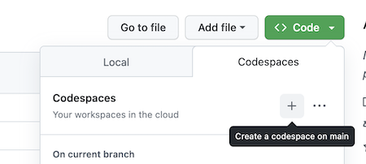

# Fundamentos de Programação: Conceitos Básicos

Este é o repositório do curso `Fundamentos de Programação: Conceitos Básicos`. Você pode acessar o conteúdo completo no [LinkedIn Learning][lil-course-url]. 

![Título completo do curso][lil-thumbnail-url]  

DESCRIÇÃO DO CURSO 

Descubra o mundo da programação com nosso curso introdutório! Usando JavaScript, você vai mergulhar na sintaxe essencial de uma linguagem de programação, criando e executando sua primeira aplicação. Explore condições, loops, variáveis e expressões, entenda diferentes tipos de dados e como eles impactam a memória. 

A melhor maneira de aprender uma linguagem é usá-la na prática. É por isso que este curso está integrado ao GitHub Codespaces, um ambiente de desenvolvimento instantâneo na nuvem que oferece toda a funcionalidade de seu IDE favorito sem a necessidade de qualquer configuração do dispositivo local. Com o Codespaces, você pode praticar em qualquer dispositivo, a qualquer momento - tudo isso sem precisar instalar nenhuma outra ferramenta. 

GITHUB CODESPACES

Este curso está integrado ao GitHub Codespaces, um ambiente desenvolvedor instantâneo na nuvem que oferece toda a funcionalidade do seu IDE favorito sem a necessidade de configurar o dispositivo local. Com o Codespaces, você pode praticar em qualquer dispositivo, a qualquer momento - tudo isso sem precisar instalar nenhuma outra ferramenta. 

Para acessar, clique no botão verde "Code", selecione a aba Codespace e inicie um novo. 

Todos os arquivos estarão lá organizados por capítulo e video.

Confira o vídeo deste curso "Como usar o GitHub Codespaces" para saber mais.

### Instrutor 

**Lucas Longo** 

Confira meus outros cursos no [LinkedIn Learning](https://www.linkedin.com/learning/instructors/lucas-longo). 

[0]: # (Replace these placeholder URLs with actual course URLs) 
[lil-course-url]: https://www.linkedin.com/learning/fundamentos-de-programacao-estruturas-de-dados-22871998/conheca-as-estruturas-de-dados 
[lil-thumbnail-url]: https://media.licdn.com/dms/image/D4D0DAQHQi2RUTxJJtg/learning-public-crop_675_1200/0/1697027775490?e=2147483647&v=beta&t=iE7YsUOmFrKoOFeDvFNmdOR_mcpiCY5KoDyM3zpP5jg 
[Veja onde clicar]: https://github.com/LinkedInLearning/Fundamentos-Programacao-Estruturas-Dados-2600255/blob/main/CodespacesInstruction.png?raw=true

[1]: # (End of BP-Instruction ###############################################################################################) 
